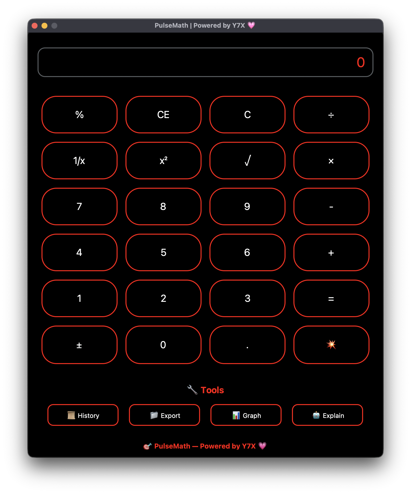

<div align="center">

# 🎯 PulseMath  
**She calculated, she served, she conquered.**

A premium desktop calculator built with `customtkinter`, rocking full **AMOLED mode**, glowing red outlines, smooth pill-shaped buttons, and smart sidebar tools like history, export, graphs, and more.  
Branded with 💗 by [Y7X-bit](https://github.com/Y7X-bit)



</div>

---

## 🌟 Features at a Glance

- 🔢 **Basic & Scientific Functions** — %, √, x², 1/x, etc.
- 📱 **Fully Responsive AMOLED UI** — Dark theme + glowing red accents
- 🧠 **Smart Sidebar Tools** —  
  ‣ 📜 History  
  ‣ 📁 Export to `.txt`  
  ‣ 📊 Plot expressions as graphs  
  ‣ 🤖 Auto explain recent calculations  
- 🔊 **Satisfying Click Sounds** with Pygame
- 💗 **Built with customtkinter** — smooth, pill-style buttons with glow

---

## 🖥️ Installation

> Python 3.9 or later required

```bash
git clone https://github.com/Y7X-bit/PulseMath.git
cd PulseMath
pip install -r requirements.txt
python PluseMath.py